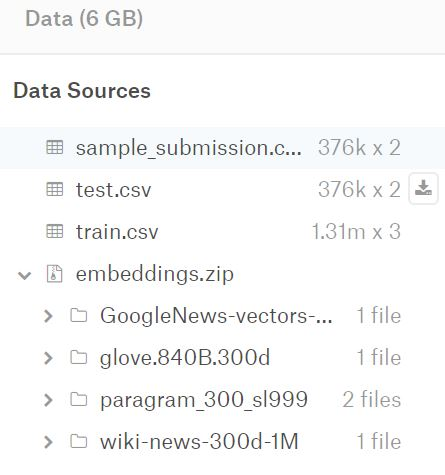
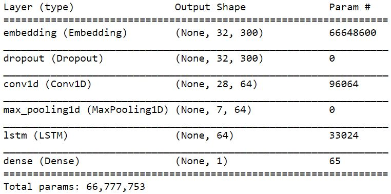
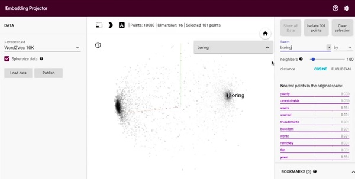

# a solution to question classification / kaggle competition

## data:
 - you can get the data from https://www.kaggle.com/c/quora-insincere-questions-classification/data

## the model summary:

## notes:
 - if you train the embedding layer yourself, you can visualize it on https://projector.tensorflow.org/
 **in this solution we didn't train an embedding layer, we used the pretrained glove one**
